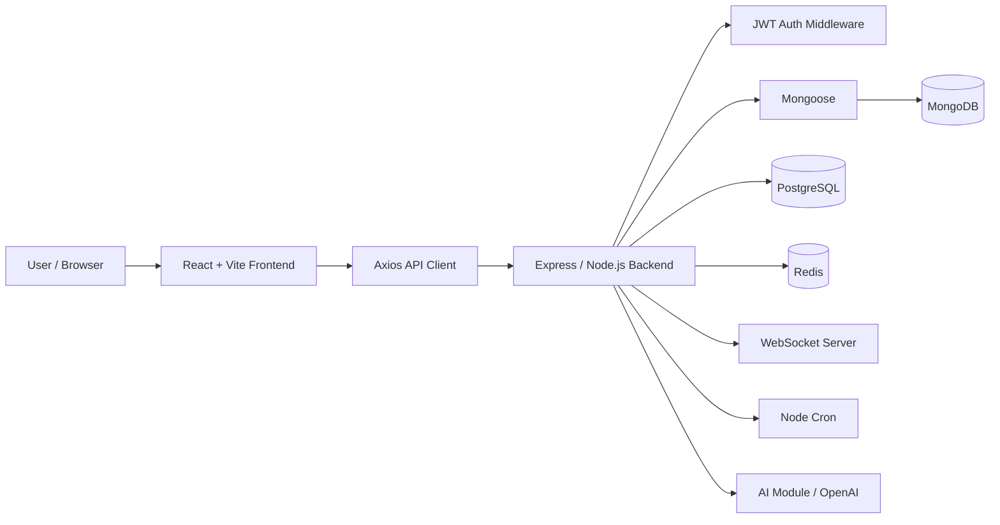

# AshTray — High-Level Design (HLD)

## 1. Architecture



MongoDB is the primary application database. PostgreSQL, Redis, WebSocket, cron, and AI modules are supporting infrastructure present in the repository.

## 2. Frontend
Technology:
- React 19
- Vite
- React Router
- Axios
- Tailwind CSS
- Recharts
- Lucide React

Responsibilities:
- Render pages/components.
- Manage local UI state with `useState`.
- Trigger API side effects with `useEffect`.
- Fetch data asynchronously.
- Store the JWT token in browser local storage.
- Attach JWT to API requests through an Axios interceptor.
- Display loading/error states.
- Protect client-side routes with `ProtectedRoute`.

Main routes:
- `/` — Login
- `/signup` — Signup
- `/dashboard` — protected dashboard
- `/analytics` — protected analytics
- `/challenges` — protected challenges
- `/craving-help` — protected craving help
- `/achievements` — protected achievements
- `/builder` — protected builder
- `/settings` — protected settings

## 3. Backend
Technology:
- Node.js
- Express
- Mongoose
- JWT
- bcryptjs
- Zod
- express-rate-limit

Responsibilities:
- Expose REST endpoints.
- Authenticate users.
- Authorize access to user-owned entries.
- Validate and normalize request data.
- Perform MongoDB CRUD operations.
- Return consistent JSON responses.
- Apply CORS and rate limiting.
- Handle server-side errors.

## 4. MongoDB
Primary models:
- User
- Entry

Relationship:
`User 1 ---- N Entry`

The Entry document stores a reference to the User's ObjectId rather than embedding the complete user document.

## 5. PostgreSQL
The repository contains a secondary relational schema:
- `users_shadow(user_id PK, email)`
- `habit_events(id PK, user_id FK, event_type, value, created_at)`

An index exists on `(user_id, created_at DESC)`.

The SQL service demonstrates PK/FK design, indexing, inserts, and JOIN queries.

## 6. Redis
The Redis service provides:
- `cacheGet(key)`
- `cacheSet(key, value, ttl)`

It is optional and safely no-ops when `REDIS_URL` is not configured.

## 7. WebSocket
The WebSocket server is attached to the HTTP server at `/ws`.
On connection it sends a JSON confirmation message. A broadcast helper is available for future real-time events.

## 8. Scheduled jobs
Node-cron defines:
- daily analytics refresh at midnight;
- monthly analytics refresh on the first day of the month.

Current jobs log refresh messages; they are infrastructure hooks rather than a complete analytics processing pipeline.

## 9. AI module
The AI module contains:
- a supportive coaching system prompt;
- OpenAI chat completion integration;
- JSON structured output;
- streaming completion support;
- embedding generation;
- a function-tool schema for `get_weekly_summary`;
- an evaluation dataset.

Important viva boundary:
The AI module exists in the repository, but the current code does not expose a complete application route that invokes all of these capabilities. Do not describe unimplemented pieces as production features.

## 10. Request lifecycle example

```text
Browser
  -> React handler
  -> Axios
  -> Express route
  -> rate-limit middleware
  -> JWT middleware
  -> controller
  -> Mongoose
  -> MongoDB
  -> JSON response
  -> React state update
  -> UI rerender
```

## 11. Failure handling
Examples:
- Missing JWT -> 401.
- Invalid JWT -> 401.
- Missing entry -> 404.
- Invalid request body -> 400 where validation middleware is applied.
- Unexpected server failure -> 500.
- Frontend API failure -> error state/alert depending on page.

## 12. Security boundaries
- JWT is verified on protected backend routes.
- Entry mutations verify ownership.
- Passwords are hashed.
- CORS restricts allowed origins through `CLIENT_ORIGINS`.
- Global rate limiting is enabled.
- Secrets are loaded from environment variables.
